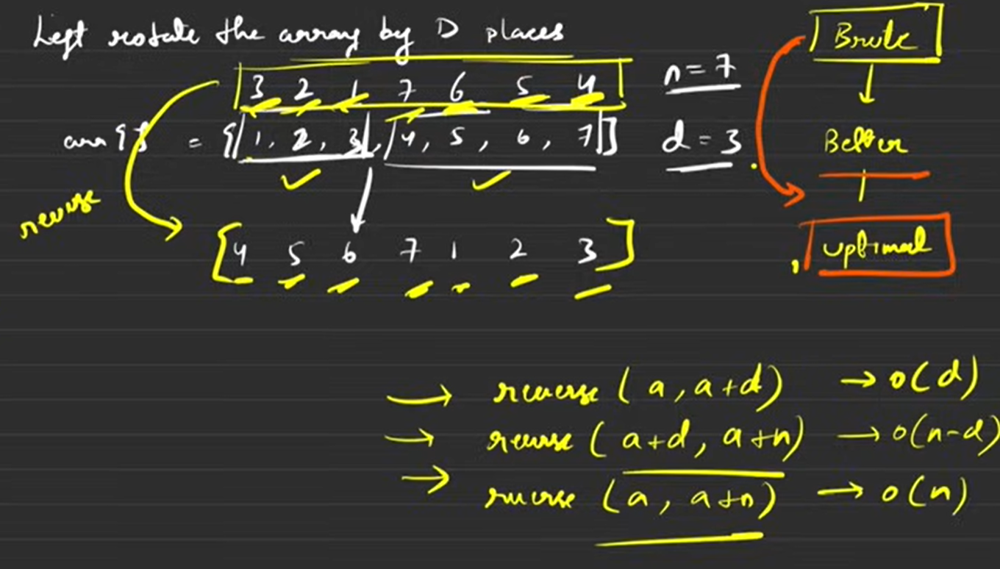

# Basics of Array

* when defined inside main it has garbage value but
* when defined globally it has 0
* max size of array is 10^6 and 10^7 globally

optimized solution for array shift by d place

1. rotate starting to d 
2. d to n
3. then start to end again