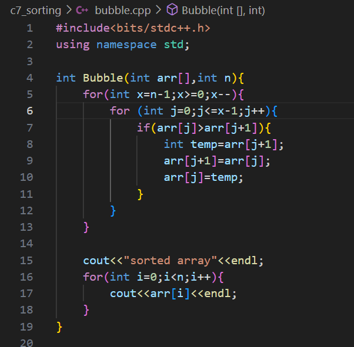

# Selection Sort
* from the entire array select the minimum put it in replace with first element
* start from index 1  select the min replace with index 1 elemnet
* do till n-1

# Bubble Sort
* push max to last by ```adjacent swaps```

its O(n^2) but if we optimize and we got sorted array we get O(n)


# Insertion Sort
* take an elemnent and place in correct position

