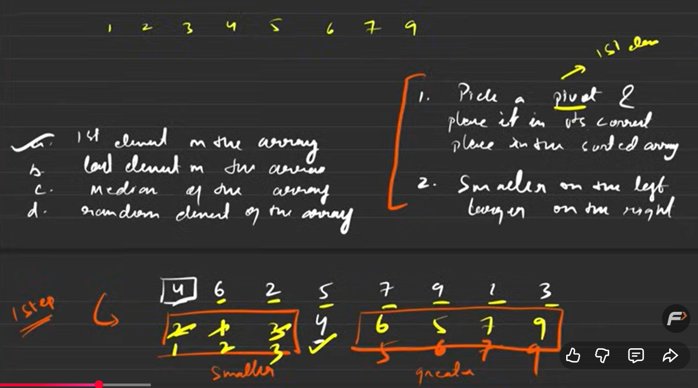
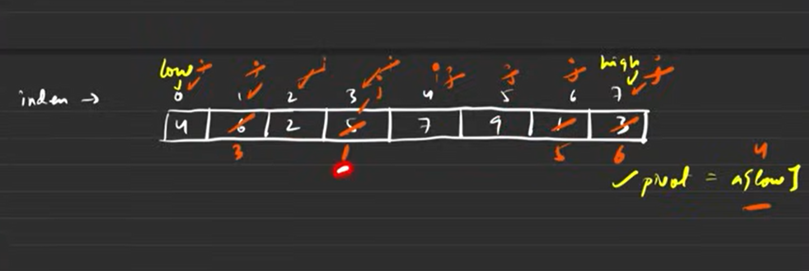

* tc same as merge but sc = O(1)

algo: 
1. take first element
2. put it in correct place now every other element if smaller put in left and if greater put on right
3. now you get two array 
4. again apply same 
5. choose first then put in correct place no small on left and big on right 
6. until you get single elmemt do this

how it works

till i cross j