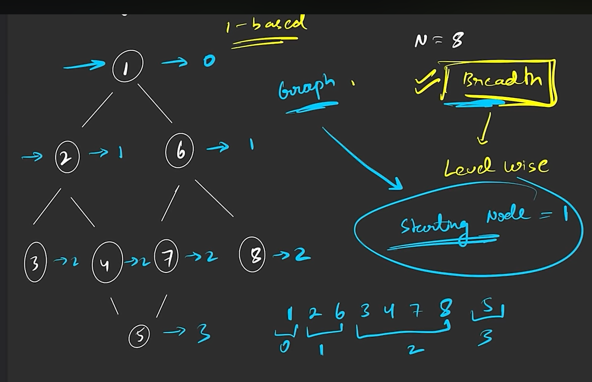
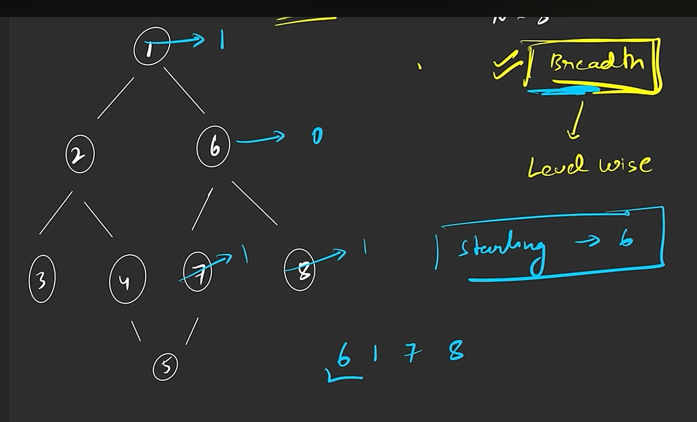
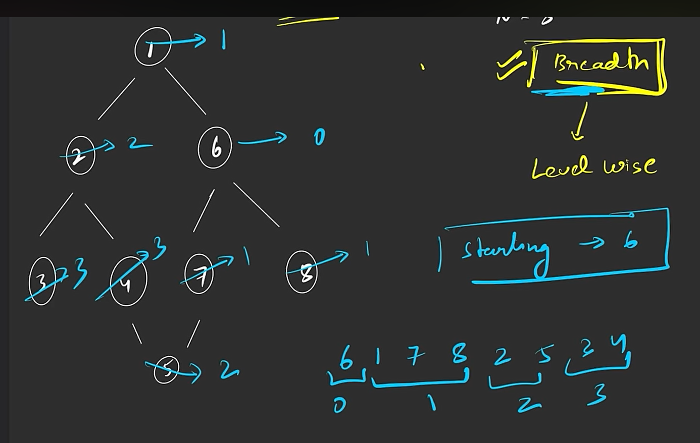
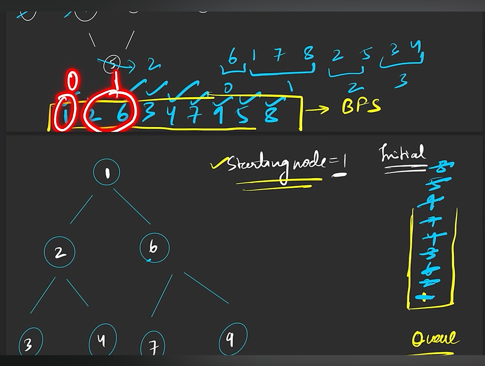
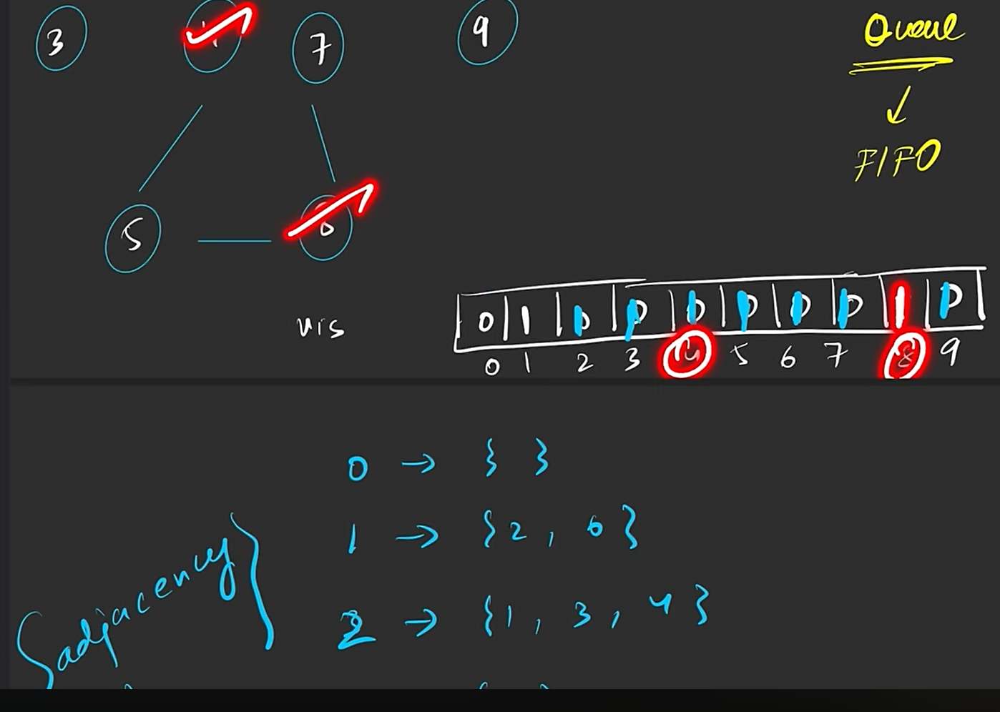
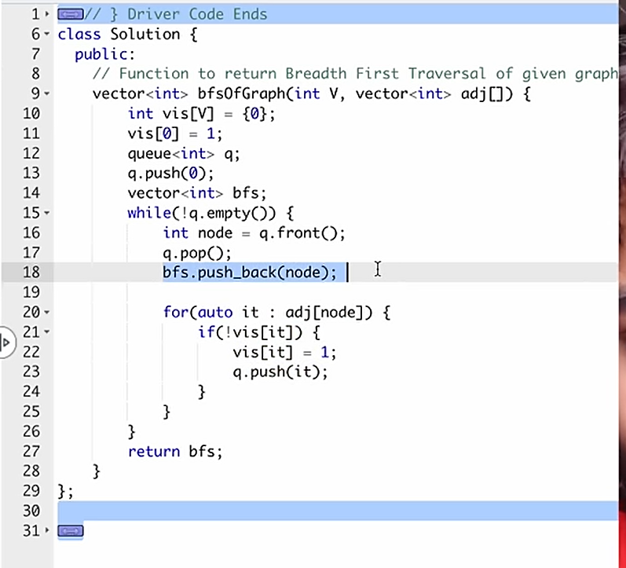
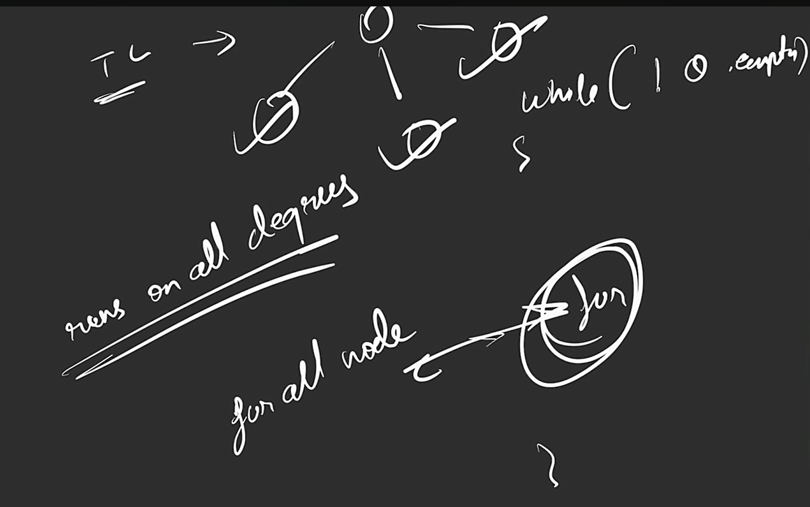
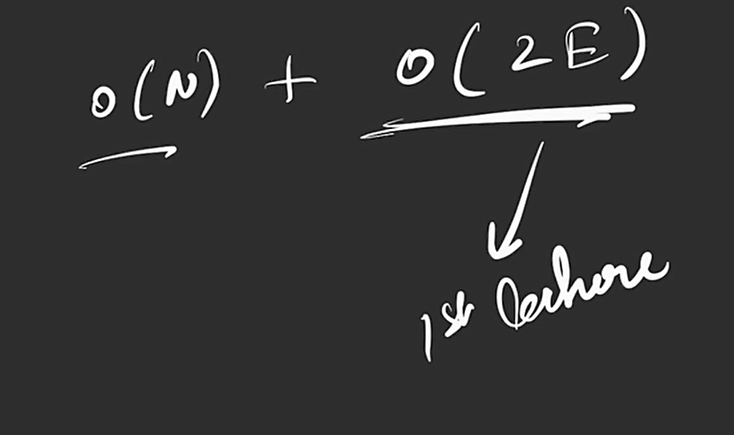

bt is also graph

G-2

Representation

1 matrix based

1-> so 2->1 mark alsoo !!!

2 list based

adjacency list

if directed graph

weighted graph

list

g-4

connected grpahs

its 4 graphs and can be
4 components of a single graph

skipped 2,3,4 bcs visited when 1 passed

g-5 BFS

at distance 1

tc

sc
O(3n)=O(n)